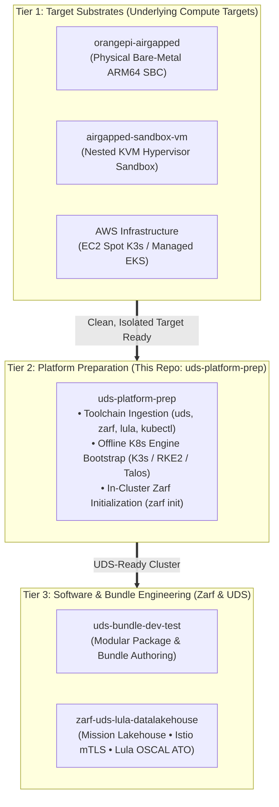

# UDS Platform Prep (`uds-platform-prep`)

[](#)
[](#)
[](#)
[](#)

An automation toolchain designed to take any isolated target system—whether a physical edge device like an Orange Pi, a nested KVM virtual machine, or a private lab node—and make it fully **Defense Unicorns UDS** and **Zarf** ready without requiring internet access.

It handles the Day-1 platform bootstrapping: downloading toolchain binaries (`uds`, `zarf`, `kubectl`, `lula`) and container image archives on a connected workstation, pushing those payloads across a local maintenance link, installing the offline Kubernetes runtime (**K3s**, **RKE2**, or **Talos**), and running `zarf init` to stand up the in-cluster OCI registry and injector webhook.

---

## Where this fits in the 3-Tier Architecture

This project represents **Tier 2: Platform Preparation**. It acts as the bridge between raw **Tier 1 Target Substrates** ([`orangepi-airgapped`](https://github.com/celttechie/orangepi-airgapped) / [`airgapped-sandbox-vm`](https://github.com/celttechie/airgapped-sandbox-vm)) and **Tier 3 Bundle Engineering** ([`uds-bundle-dev-test`](https://github.com/celttechie/uds-bundle-dev-test) / [`zarf-uds-lula-datalakehouse`](https://github.com/celttechie/zarf-uds-lula-datalakehouse)).



---

## 🔌 Technician Laptop & Jump Host Delivery Model

In a true air-gapped environment, target nodes have **zero WAN access**. This repository operates from a **connected technician laptop / workstation** that acts as the staging bridge over a local maintenance network:

```
┌────────────────────────────────────────────────────────┐
│ TECHNICIAN WORKSTATION / LAPTOP                        │
│ • Downloads toolchain binaries & air-gap tarballs      │
│ • Manages version matrix in versions.env               │
│ • Packages payload archive (platform-payloads.tar.gz)  │
└───────────────────────────┬────────────────────────────┘
                            │
       ┌────────────────────┴────────────────────┐
       │ Push Payloads & Initialize over SSH     │
       ▼                                         ▼
┌──────────────────────────────┐ ┌──────────────────────────────┐
│ TARGET A: Tactical Edge SBC  │ │ TARGET B: Nested KVM VM      │
│ (orangepi-airgapped)         │ │ (airgapped-sandbox-vm)       │
│ • Connected via direct       │ │ • Connected via SSH jump host│
│   point-to-point Ethernet    │ │   into isolated VM network   │
│   cable (192.168.42.100)     │ │   (mode='none', 10.160.0.34) │
│ • Updates CLIs to latest     │ │ • Installs K3s/RKE2 offline  │
│ • Executes `zarf init`       │ │ • Executes `zarf init`       │
└──────────────────────────────┘ └──────────────────────────────┘
```

1. **When targeting an Orange Pi (`orangepi-airgapped`):**  
   The OS and initial K3s engine are already flashed on the SD card. Running `uds-platform-prep` over the direct Ethernet link updates the CLIs to latest versions in `versions.env` and executes the missing `zarf init` step to establish the in-cluster registry.
2. **When targeting an isolated VM (`airgapped-sandbox-vm`):**  
   The VM is a clean, blank OS guest with no internet access. Running `uds-platform-prep` SCPs the toolchains across the hypervisor jump host, installs K3s/RKE2 offline, and executes `zarf init`.

---

## Features

- **Automated Version Tracking**: Query GitHub release endpoints to detect and bump tool versions (`make update-versions`).
- **Air-Gap Asset Ingestion**: Downloads CLI binaries, Zarf init packages, and K8s air-gap images into `payloads/` (`make download`).
- **One-Command Target Prep**: Packages payloads, syncs across SSH jump host (`t5600`), deploys Kubernetes, runs `zarf init`, and retrieves `kubeconfig` (`make deploy`).
- **Multi-Target Support**:
  - `k3s-sandbox`: Lightweight single-node dev/test runtime.
  - `rke2-hardened`: DoD STIG and FIPS 140-2/3 compliant enterprise runtime.
  - `talos-nested`: Immutable OS and API-managed Kubernetes platform.

---

## Quick Start

### 1. Configure Target Connection
```bash
make configure
# Edit target.env with your host details (defaults to 10.160.0.34 via t5600)
```

### 2. Download Toolchains & Air-Gap Assets
```bash
make download
```

### 3. Deploy Runtime & Initialize Zarf on Air-Gapped Target
```bash
make deploy
```

### 4. Check Cluster Status
```bash
make status
```

---

## Updating Toolchains as New Releases Occur

To discover and update to newer releases of `uds`, `zarf`, `kubectl`, `lula`, or `k3s`:

1. **Check & update `versions.env`**:
   ```bash
   make update-versions
   ```
2. **Download new releases**:
   ```bash
   make download
   ```
3. **Push updates to air-gapped target**:
   ```bash
   make deploy
   ```

---

## Directory Structure

```
uds-platform-prep/
├── docs/adr/              # Architecture Decision Records
│   ├── 0001-architecture-of-platform-preparation.md
│   └── 0002-airgap-payload-lifecycle-and-tool-versioning.md
├── payloads/              # Local storage for air-gap assets (git-ignored)
│   ├── bin/               # CLI binaries (uds, zarf, kubectl, lula, k3s)
│   └── packages/          # Zarf init and K8s airgap tar.zst packages
├── scripts/
│   ├── download-payloads.sh # Ingests tools based on versions.env
│   ├── update-versions.sh   # Discovers new releases from GitHub
│   └── deploy-target.sh     # Remote push and cluster initialization
├── targets/               # Environment target definitions
│   ├── k3s-sandbox/
│   ├── rke2-hardened/
│   └── talos-nested/
├── versions.env           # Centralized toolchain version matrix
├── target.env.example     # Target connection template
├── Makefile               # Task automation entrypoint
└── README.md
```
